# 📚 DocChat AI - Intelligent Advanced RAG-Based Document Q&A System

<div align="center">


**A powerful RAG (Retrieval-Augmented Generation) application for intelligent document analysis and question answering.**

[Features](#-features) • [Architecture](#-architecture) • [Installation](#-installation) • [Usage](#-usage) • [API](#-api-documentation) • [Performance](#-performance-benchmarks) • [Deployment](#-deployment-guide) • [Troubleshooting](#-troubleshooting)

</div>

---

## 📋 Quick Start

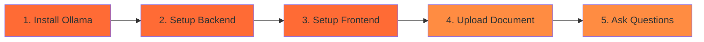
```mermaid
graph LR
    A[1. Install Ollama] --> B[2. Setup Backend]
    B --> C[3. Setup Frontend]
    C --> D[4. Upload Document]
    D --> E[5. Ask Questions]
    
    style A fill:#ff6b35
    style B fill:#ff6b35
    style C fill:#ff6b35
    style D fill:#ff8c42
    style E fill:#ff8c42
```

### 5-Minute Setup

1. **Install Ollama** (if not already installed)
   ```bash
   # Download from https://ollama.ai
   ollama pull nomic-embed-text
   ```

2. **Backend Setup**
   ```bash
   cd backend
   python -m venv .venv
   .venv\Scripts\activate  # Windows
   pip install -r requirements.txt
   # Add GROQ_API_KEY to .env file
   uvicorn main:app --reload
   ```

3. **Frontend Setup**
   ```bash
   cd frontend
   npm install
   npm run dev
   ```

4. **Start Using**
   - Open `http://localhost:5173`
   - Upload a document
   - Ask questions!

---

## 🌟 Features

### Core Capabilities

| Feature | Description |
|---------|-------------|
| 🔑 **Backend API Keys** | Groq API key managed securely in backend `.env` file |
| 📄 **Multi-Format Support** | Upload and analyze PDF, DOCX, DOC, CSV, XLSX, and XLS documents |
| 🧠 **Advanced RAG System** | Multi-vector retrieval with Ollama embeddings and Groq LLM |
| 💬 **Real-time Streaming** | Live AI responses with Server-Sent Events (SSE) |
| 🎯 **Accurate Citations** | Every answer includes page number references |
| 🖼️ **Multimodal Processing** | Extracts and analyzes text, tables, and structured data |
| 🗂️ **Chat History** | Persistent conversation management with multiple chats |
| 🗑️ **Easy Management** | Delete chats and associated documents with one click |
| 🎨 **Modern UI** | Beautiful sunset-themed interface with glassmorphism effects |
| 📊 **In-Browser Viewing** | View documents directly in browser (PDF, DOCX, CSV, Excel) |

### Supported File Types

| Format | Extension | Processing Library | Viewer Support |
|--------|-----------|-------------------|----------------|
| PDF | `.pdf` | pdfplumber | ✅ Inline iframe |
| Word (New) | `.docx` | unstructured | ✅ HTML rendering |
| Word (Old) | `.doc` | unstructured | ⬇️ Download only |
| CSV | `.csv` | pandas | ✅ Table view |
| Excel (New) | `.xlsx` | pandas + openpyxl | ✅ Table view with sheets |
| Excel (Old) | `.xls` | pandas + xlrd | ✅ Table view with sheets |

### Technical Highlights

| Aspect | Implementation |
|--------|----------------|
| ⚡ **Performance** | ChromaDB vector search with optimized chunking |
| 🔄 **Async Processing** | Non-blocking document processing and queries |
| 📊 **Smart Context** | Retrieves up to 10 most relevant chunks with 2000-char chunks |
| 🎭 **Clean Formatting** | Bold highlights, bullet lists, and citation badges |
| 🔐 **CORS Enabled** | Secure cross-origin resource sharing |
| 📝 **Type Safety** | Pydantic models for request/response validation |
| 🛡️ **Rate Limiting** | Built-in handling for API rate limits with retry logic |
| 📏 **Context Management** | Automatic truncation to stay within token limits |

---

## 🏗️ Architecture

### System Architecture Diagram

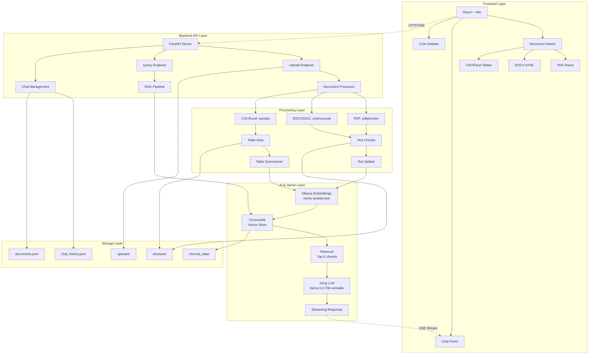
```mermaid
graph TB
    subgraph "Frontend Layer"
        A[React + Vite] --> B[Document Viewer]
        A --> C[Chat Panel]
        A --> D[Chat Sidebar]
        B --> E[PDF iframe]
        B --> F[DOCX HTML]
        B --> G[CSV/Excel Tables]
    end
    
    subgraph "Backend API Layer"
        H[FastAPI Server] --> I[Upload Endpoint]
        H --> J[Query Endpoint]
        H --> K[Chat Management]
        I --> L[Document Processor]
        J --> M[RAG Pipeline]
    end
    
    subgraph "Processing Layer"
        L --> N[PDF: pdfplumber]
        L --> O[DOCX/DOC: unstructured]
        L --> P[CSV/Excel: pandas]
        N --> Q[Text Chunks]
        O --> Q
        P --> R[Table Data]
        Q --> S[Text Splitter]
        R --> T[Table Summarizer]
    end
    
    subgraph "AI & Vector Layer"
        S --> U[Ollama Embeddings<br/>nomic-embed-text]
        T --> U
        U --> V[ChromaDB<br/>Vector Store]
        M --> V
        V --> W[Retrieval<br/>Top K chunks]
        W --> X[Groq LLM<br/>llama-3.3-70b-versatile]
        X --> Y[Streaming Response]
    end
    
    subgraph "Storage Layer"
        V --> Z[chroma_data/]
        Q --> AA[docstore/]
        R --> AA
        K --> AB[chat_history.json]
        K --> AC[documents.json]
        I --> AD[uploads/]
    end
    
    A -.HTTP/SSE.-> H
    Y -.SSE Stream.-> C
```

### Data Flow Diagram

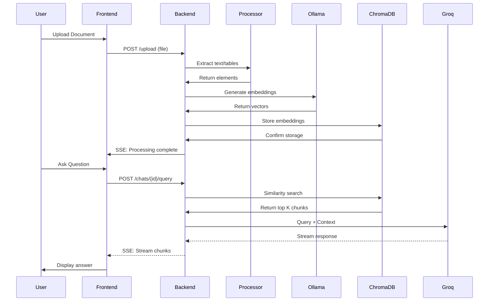
```mermaid
sequenceDiagram
    participant User
    participant Frontend
    participant Backend
    participant Processor
    participant Ollama
    participant ChromaDB
    participant Groq
    
    User->>Frontend: Upload Document
    Frontend->>Backend: POST /upload (file)
    Backend->>Processor: Extract text/tables
    Processor->>Backend: Return elements
    
    Backend->>Ollama: Generate embeddings
    Ollama->>Backend: Return vectors
    Backend->>ChromaDB: Store embeddings
    ChromaDB->>Backend: Confirm storage
    
    Backend->>Frontend: SSE: Processing complete
    
    User->>Frontend: Ask Question
    Frontend->>Backend: POST /chats/{id}/query
    Backend->>ChromaDB: Similarity search
    ChromaDB->>Backend: Return top K chunks
    Backend->>Groq: Query + Context
    Groq-->>Backend: Stream response
    Backend-->>Frontend: SSE: Stream chunks
    Frontend->>User: Display answer
```

### Technology Stack

#### Backend

| Component | Technology | Purpose |
|-----------|-----------|---------|
| **Framework** | FastAPI | REST API and SSE streaming |
| **LLM** | Groq (llama-3.3-70b-versatile) | Language model for Q&A |
| **Embeddings** | Ollama (nomic-embed-text) | Local embedding generation |
| **Vector Store** | ChromaDB | Persistent vector database |
| **PDF Processing** | pdfplumber | PDF text and table extraction |
| **Office Docs** | unstructured | DOCX/DOC parsing |
| **Spreadsheets** | pandas + openpyxl/xlrd | CSV/Excel processing |
| **Async Runtime** | asyncio, aiofiles | Non-blocking I/O |

#### Frontend

| Component | Technology | Purpose |
|-----------|-----------|---------|
| **Framework** | React 18.3 | UI components |
| **Build Tool** | Vite | Fast development and building |
| **Styling** | Tailwind CSS | Utility-first styling |
| **PDF Viewer** | Browser iframe | PDF rendering |
| **DOCX Viewer** | mammoth.js | DOCX to HTML conversion |
| **CSV Parser** | papaparse | CSV parsing and display |
| **Excel Viewer** | xlsx (SheetJS) | Excel file parsing |

---

## 🚀 Installation

### Prerequisites

| Requirement | Version | Notes |
|------------|---------|-------|
| Python | 3.11+ | Required for backend |
| Node.js | 18+ | Required for frontend |
| Ollama | Latest | Must be running locally |
| Groq API Key | - | Get from [console.groq.com](https://console.groq.com) |

### 1. Clone the Repository

```bash
git clone https://github.com/Aafimalek/advanced_rag.git
cd chat_rag
```

### 2. Setup Ollama

Install and start Ollama, then pull the embedding model:

```bash
# Install Ollama from https://ollama.ai
# Start Ollama service (usually runs automatically)

# Pull the embedding model
ollama pull nomic-embed-text
```

Verify Ollama is running:
```bash
curl http://127.0.0.1:11434/api/tags
```

### 3. Backend Setup

#### Create Virtual Environment

```bash
cd backend
python -m venv .venv

# Windows
.venv\Scripts\activate

# macOS/Linux
source .venv/bin/activate
```

#### Install Dependencies

```bash
pip install -r requirements.txt
```

#### Configure Environment Variables

Create a `.env` file in the `backend` directory:

```env
GROQ_API_KEY=your_groq_api_key_here
```

Get your Groq API key from [console.groq.com](https://console.groq.com/settings/keys)

#### Start Backend Server

```bash
uvicorn main:app --reload
```

Server will run on `http://localhost:8000`

### 4. Frontend Setup

#### Install Dependencies

```bash
cd ../frontend
npm install
```

#### Start Development Server

```bash
npm run dev
```

Frontend will run on `http://localhost:5173`

---

## 🔄 Complete Workflow Diagram

### End-to-End User Journey

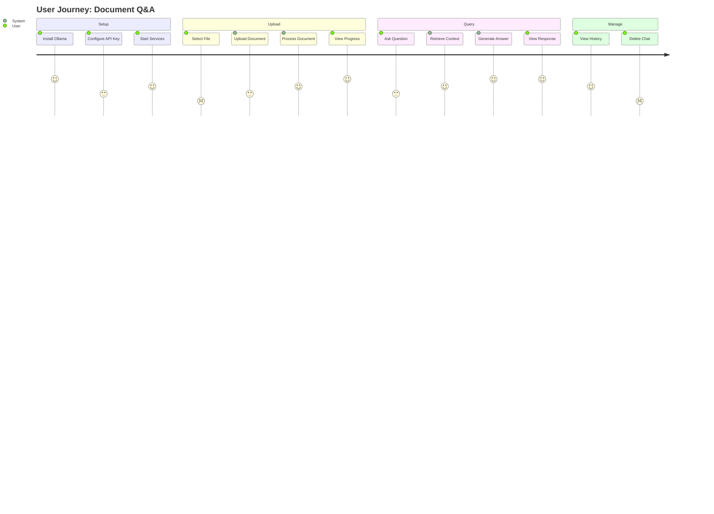
```mermaid
journey
    title User Journey: Document Q&A
    section Setup
      Install Ollama: 5: User
      Configure API Key: 3: User
      Start Services: 4: User
    section Upload
      Select File: 2: User
      Upload Document: 3: System
      Process Document: 4: System
      View Progress: 5: User
    section Query
      Ask Question: 3: User
      Retrieve Context: 4: System
      Generate Answer: 5: System
      View Response: 5: User
    section Manage
      View History: 4: User
      Delete Chat: 2: User
```

### API Request Flow

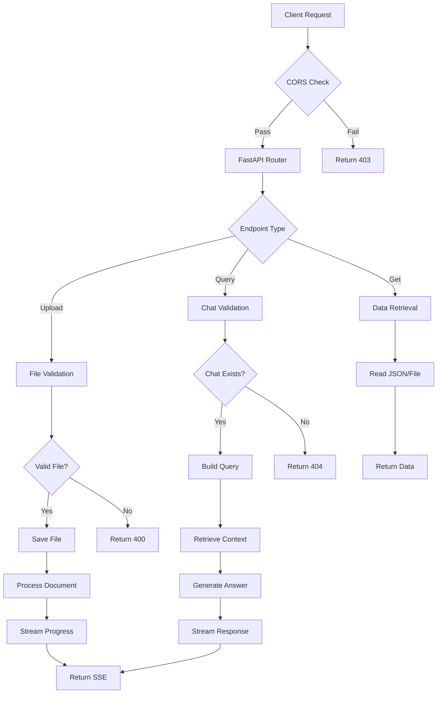
```mermaid
graph TB
    A[Client Request] --> B{CORS Check}
    B -->|Pass| C[FastAPI Router]
    B -->|Fail| D[Return 403]
    
    C --> E{Endpoint Type}
    E -->|Upload| F[File Validation]
    E -->|Query| G[Chat Validation]
    E -->|Get| H[Data Retrieval]
    
    F --> I{Valid File?}
    I -->|Yes| J[Save File]
    I -->|No| K[Return 400]
    
    J --> L[Process Document]
    L --> M[Stream Progress]
    M --> N[Return SSE]
    
    G --> O{Chat Exists?}
    O -->|Yes| P[Build Query]
    O -->|No| Q[Return 404]
    
    P --> R[Retrieve Context]
    R --> S[Generate Answer]
    S --> T[Stream Response]
    T --> N
    
    H --> U[Read JSON/File]
    U --> V[Return Data]
```

### Decision Tree: File Processing

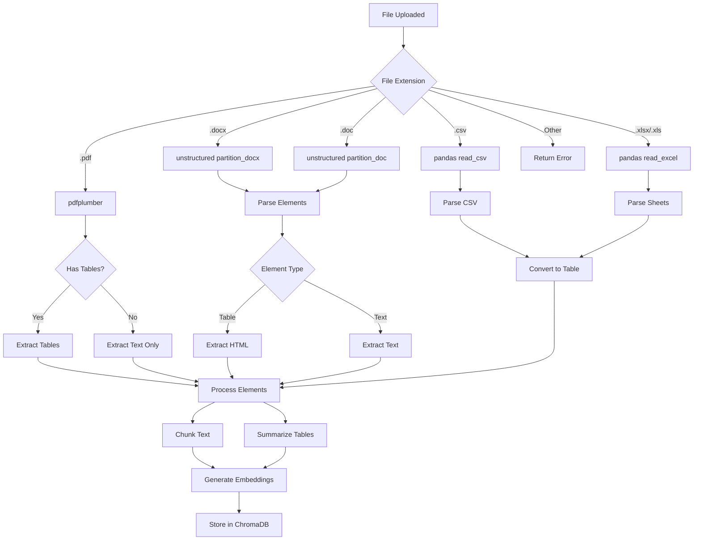
```mermaid
graph TD
    A[File Uploaded] --> B{File Extension}
    B -->|.pdf| C[pdfplumber]
    B -->|.docx| D[unstructured partition_docx]
    B -->|.doc| E[unstructured partition_doc]
    B -->|.csv| F[pandas read_csv]
    B -->|.xlsx/.xls| G[pandas read_excel]
    B -->|Other| H[Return Error]
    
    C --> I{Has Tables?}
    I -->|Yes| J[Extract Tables]
    I -->|No| K[Extract Text Only]
    
    D --> L[Parse Elements]
    E --> L
    L --> M{Element Type}
    M -->|Table| N[Extract HTML]
    M -->|Text| O[Extract Text]
    
    F --> P[Parse CSV]
    G --> Q[Parse Sheets]
    P --> R[Convert to Table]
    Q --> R
    
    J --> S[Process Elements]
    K --> S
    N --> S
    O --> S
    R --> S
    
    S --> T[Chunk Text]
    S --> U[Summarize Tables]
    T --> V[Generate Embeddings]
    U --> V
    V --> W[Store in ChromaDB]
```

---

## 📖 Usage

### First Time Setup

1. **Ensure Ollama is Running**
   - Ollama must be running at `http://127.0.0.1:11434`
   - Verify with: `curl http://127.0.0.1:11434/api/tags`

2. **Configure Groq API Key**
   - Add your Groq API key to `backend/.env` file
   - Format: `GROQ_API_KEY=gsk_your_key_here`
   - The API key is managed by the backend, not the frontend

### Basic Workflow

1. **Upload a Document**
   - Click the "New Chat" button in the header
   - Select a supported file (PDF, DOCX, DOC, CSV, XLSX, XLS)
   - Wait for AI processing (you'll see live progress updates)
   - Processing includes: extraction → chunking → embedding → indexing

2. **Ask Questions**
   - Type your question in the input box
   - Press Enter or click Send
   - Get streaming AI responses with page citations
   - View document alongside chat for context

3. **View Documents**
   - **PDFs**: View inline in the document viewer
   - **DOCX**: Rendered as formatted HTML
   - **CSV/Excel**: Displayed as interactive tables
   - **DOC**: Download button (no preview available)

4. **Manage Chats**
   - Click on any chat in the sidebar to view it
   - Hover over a chat and click the trash icon to delete
   - Deletion removes both chat and associated document

---

## 🔧 Configuration

### Backend Configuration (`backend/main.py`)

| Setting | Value | Description |
|---------|-------|-------------|
| **LLM Model** | `llama-3.3-70b-versatile` | Groq model for Q&A |
| **Embedding Model** | `nomic-embed-text:latest` | Ollama embedding model |
| **Ollama URL** | `http://127.0.0.1:11434` | Local Ollama instance |
| **Chunk Size** | `2000` | Characters per chunk |
| **Chunk Overlap** | `400` | Overlap between chunks |
| **Max Retrieval (k)** | `10` | Max chunks per query |
| **Max Context Length** | `40000` | Characters (prevents token overflow) |
| **Max Chunk Length** | `20000` | Characters per individual chunk |
| **Temperature** | `0.3` | LLM creativity (lower = more factual) |
| **Max Retries** | `3` | Retry attempts for rate limits |

### Environment Variables (`.env`)

```env
# Required
GROQ_API_KEY=your_groq_api_key_here

# Optional (if using different Ollama URL)
OLLAMA_BASE_URL=http://127.0.0.1:11434
```

### Frontend Configuration (`frontend/src/App.jsx`)

```javascript
// API Configuration
const API_URL = 'http://127.0.0.1:8000';

// Query Settings
const k = 10;  // Number of chunks to retrieve (matches backend limit)
```

---

## 📡 API Documentation

### Base URL
```
http://localhost:8000
```

### Endpoints

#### 1. Health Check
```http
GET /
Response: {"status": "DocChat AI is running"}
```

#### 2. Validate API Key
```http
POST /validate-api-key
Headers:
  X-API-Key: optional_groq_api_key (uses .env if not provided)

Response: 200 OK
{
  "valid": true
}
```

#### 3. Upload Document
```http
POST /upload
Content-Type: multipart/form-data

Parameters:
  - file: Binary file (PDF/DOCX/DOC/CSV/XLSX/XLS)

Response: SSE Stream
  data: {"step": "extracting", "message": "..."}
  data: {"step": "chunking", "message": "..."}
  data: {"step": "summarizing", "message": "..."}
  data: {"step": "indexing", "message": "..."}
  data: {"step": "complete", "document": {...}, "chat": {...}}
```

#### 4. List Chats
```http
GET /chats

Response: 200 OK
[
  {
    "id": "uuid",
    "title": "document.pdf",
    "document_id": "doc-uuid",
    "created_at": "2024-01-01T00:00:00",
    "messages": [...]
  }
]
```

#### 5. Get Chat Details
```http
GET /chats/{chat_id}

Response: 200 OK
{
  "id": "uuid",
  "title": "Chat Title",
  "document_id": "doc-uuid",
  "created_at": "2024-01-01T00:00:00",
  "messages": [...],
  "document": {
    "id": "doc-uuid",
    "name": "document.pdf",
    "path": "uploads/...",
    "stats": {"texts": 10, "tables": 2}
  }
}
```

#### 6. Query Chat
```http
POST /chats/{chat_id}/query
Content-Type: application/json

Body:
{
  "query": "What is this document about?",
  "k": 10
}

Response: SSE Stream
  data: {"type": "context", "chunks": [...]}
  data: {"type": "chunk", "content": "..."}
  data: {"type": "complete"}
```

#### 7. Delete Chat
```http
DELETE /chats/{chat_id}

Response: 200 OK
{
  "message": "Chat deleted successfully",
  "chat_id": "uuid",
  "document_deleted": true
}
```

#### 8. Get Document File
```http
GET /documents/{document_id}/file

Response: 200 OK
Content-Type: application/pdf | application/vnd.openxmlformats-officedocument.wordprocessingml.document | text/csv | ...
[File binary data]
```

---

## 📂 Project Structure

```
chat_rag/
├── backend/
│   ├── main.py                 # FastAPI application
│   ├── requirements.txt        # Python dependencies
│   ├── .env                    # Environment variables (Groq API key)
│   ├── chat_history.json       # Chat persistence
│   ├── documents.json          # Document metadata
│   ├── document_cache.json    # Document hash cache
│   ├── uploads/               # Uploaded files
│   ├── chroma_data/           # ChromaDB vector store
│   └── docstore/              # Document chunks storage
│
├── frontend/
│   ├── src/
│   │   ├── App.jsx            # Main application
│   │   ├── components/
│   │   │   ├── ChatPanel.jsx        # Chat interface
│   │   │   ├── ChatSidebar.jsx     # Chat list
│   │   │   ├── DocumentViewer.jsx  # Document viewer (PDF/DOCX/CSV/Excel)
│   │   │   └── ui/
│   │   │       ├── Spinner.jsx      # Loading spinner
│   │   │       └── Toast.jsx        # Notifications
│   │   ├── index.css          # Global styles
│   │   └── main.jsx           # React entry
│   ├── package.json           # Node dependencies
│   └── vite.config.js         # Vite configuration
│
├── README.md                  # This file
└── .gitignore                 # Git ignore rules
```

---

## 🎨 UI Features

### Design Highlights
- **Sunset Theme**: Warm orange and amber accent colors
- **Glassmorphism**: Translucent panels with blur effects
- **Responsive**: Works on desktop and tablet
- **Animations**: Smooth transitions and hover effects
- **Icons**: SVG icons for all actions
- **Dark Mode**: Built-in dark color scheme

### Color Palette
```css
Primary Background: #1a1625 (Deep purple-black)
Secondary Background: #241e30 (Dark violet)
Primary Accent: #ff6b35 (Vibrant orange)
Secondary Accent: #ff8c42 (Warm tangerine)
Text Primary: #fef3f0 (Warm off-white)
Citation Badge: #ff6b35 with 20% opacity background
```

---

## 🔍 How RAG Works

### Document Processing Pipeline

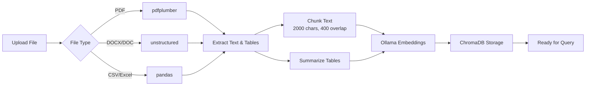
```mermaid
graph LR
    A[Upload File] --> B{File Type}
    B -->|PDF| C[pdfplumber]
    B -->|DOCX/DOC| D[unstructured]
    B -->|CSV/Excel| E[pandas]
    C --> F[Extract Text & Tables]
    D --> F
    E --> F
    F --> G[Chunk Text<br/>2000 chars, 400 overlap]
    F --> H[Summarize Tables]
    G --> I[Ollama Embeddings]
    H --> I
    I --> J[ChromaDB Storage]
    J --> K[Ready for Query]
```

### Query Processing Flow

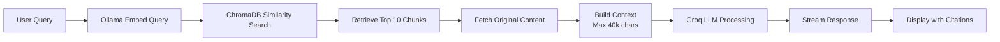
```mermaid
graph LR
    A[User Query] --> B[Ollama Embed Query]
    B --> C[ChromaDB Similarity Search]
    C --> D[Retrieve Top 10 Chunks]
    D --> E[Fetch Original Content]
    E --> F[Build Context<br/>Max 40k chars]
    F --> G[Groq LLM Processing]
    G --> H[Stream Response]
    H --> I[Display with Citations]
```

### Detailed Component Interaction

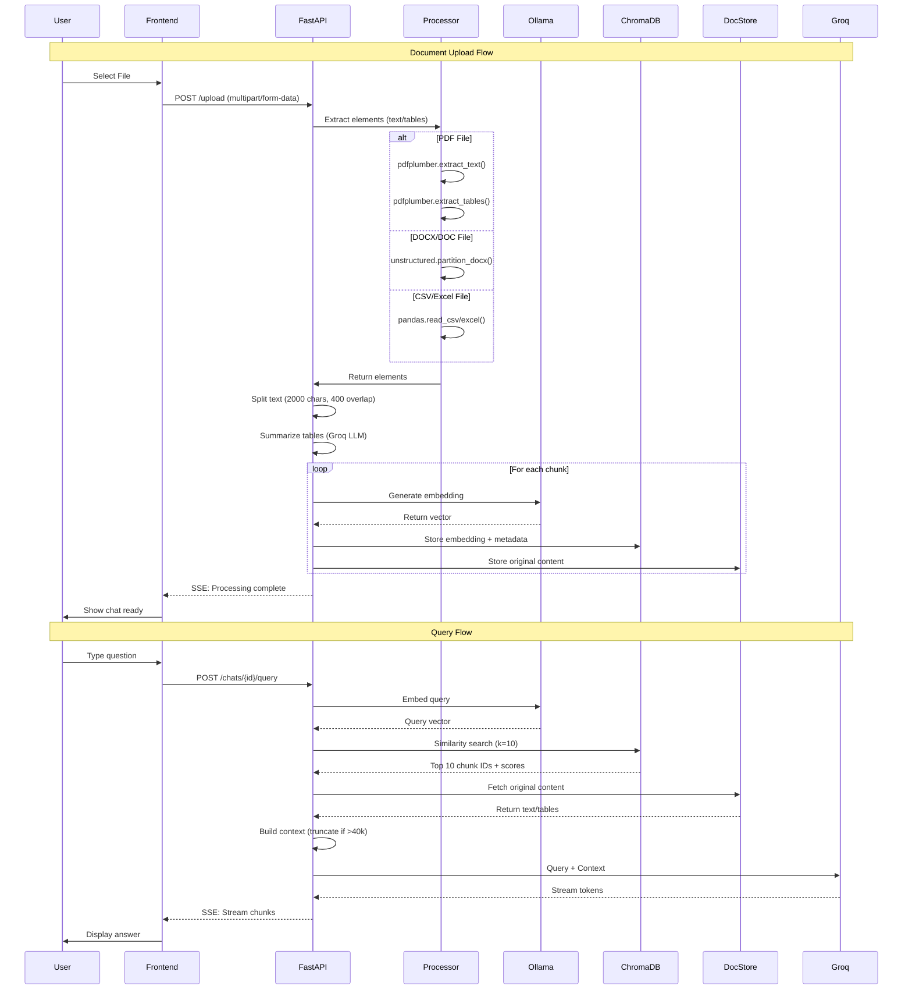
```mermaid
sequenceDiagram
    participant User
    participant Frontend
    participant FastAPI
    participant Processor
    participant Ollama
    participant ChromaDB
    participant DocStore
    participant Groq
    
    Note over User,Groq: Document Upload Flow
    User->>Frontend: Select File
    Frontend->>FastAPI: POST /upload (multipart/form-data)
    FastAPI->>Processor: Extract elements (text/tables)
    
    alt PDF File
        Processor->>Processor: pdfplumber.extract_text()
        Processor->>Processor: pdfplumber.extract_tables()
    else DOCX/DOC File
        Processor->>Processor: unstructured.partition_docx()
    else CSV/Excel File
        Processor->>Processor: pandas.read_csv/excel()
    end
    
    Processor->>FastAPI: Return elements
    FastAPI->>FastAPI: Split text (2000 chars, 400 overlap)
    FastAPI->>FastAPI: Summarize tables (Groq LLM)
    
    loop For each chunk
        FastAPI->>Ollama: Generate embedding
        Ollama-->>FastAPI: Return vector
        FastAPI->>ChromaDB: Store embedding + metadata
        FastAPI->>DocStore: Store original content
    end
    
    FastAPI-->>Frontend: SSE: Processing complete
    Frontend->>User: Show chat ready
    
    Note over User,Groq: Query Flow
    User->>Frontend: Type question
    Frontend->>FastAPI: POST /chats/{id}/query
    FastAPI->>Ollama: Embed query
    Ollama-->>FastAPI: Query vector
    FastAPI->>ChromaDB: Similarity search (k=10)
    ChromaDB-->>FastAPI: Top 10 chunk IDs + scores
    FastAPI->>DocStore: Fetch original content
    DocStore-->>FastAPI: Return text/tables
    FastAPI->>FastAPI: Build context (truncate if >40k)
    FastAPI->>Groq: Query + Context
    Groq-->>FastAPI: Stream tokens
    FastAPI-->>Frontend: SSE: Stream chunks
    Frontend->>User: Display answer
```

### Error Handling & Rate Limiting Flow

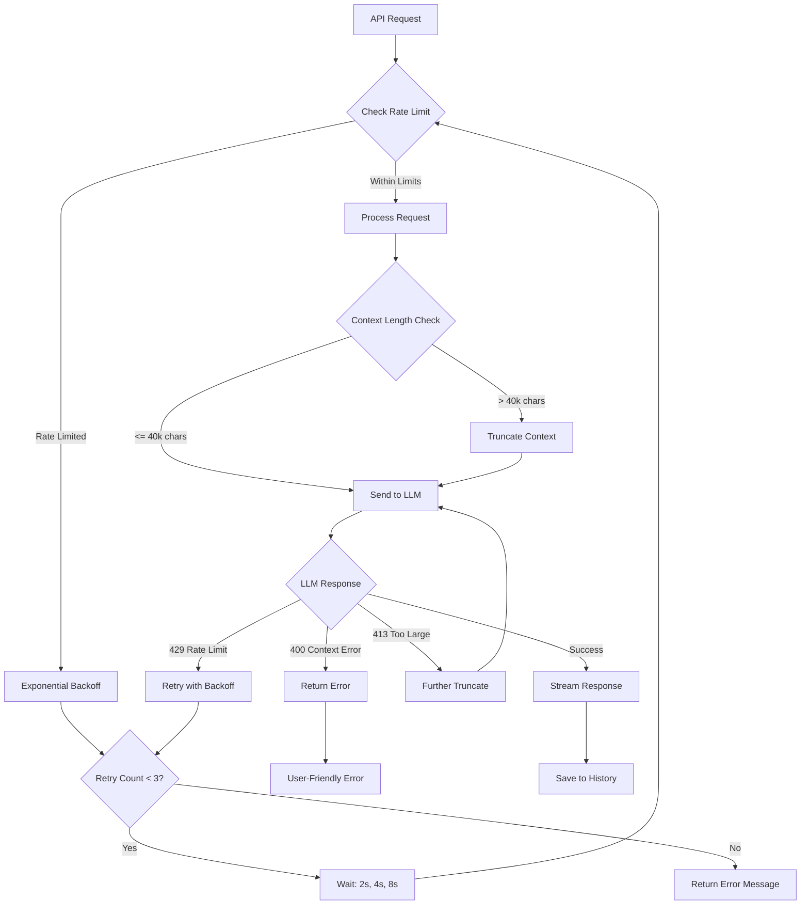
```mermaid
graph TD
    A[API Request] --> B{Check Rate Limit}
    B -->|Within Limits| C[Process Request]
    B -->|Rate Limited| D[Exponential Backoff]
    D --> E{Retry Count < 3?}
    E -->|Yes| F[Wait: 2s, 4s, 8s]
    F --> B
    E -->|No| G[Return Error Message]
    
    C --> H{Context Length Check}
    H -->|> 40k chars| I[Truncate Context]
    H -->|<= 40k chars| J[Send to LLM]
    I --> J
    
    J --> K{LLM Response}
    K -->|Success| L[Stream Response]
    K -->|429 Rate Limit| M[Retry with Backoff]
    K -->|413 Too Large| N[Further Truncate]
    K -->|400 Context Error| O[Return Error]
    
    M --> E
    N --> J
    O --> P[User-Friendly Error]
    L --> Q[Save to History]
```

### Context Truncation Strategy

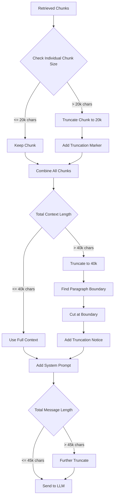
```mermaid
graph TD
    A[Retrieved Chunks] --> B{Check Individual Chunk Size}
    B -->|> 20k chars| C[Truncate Chunk to 20k]
    B -->|<= 20k chars| D[Keep Chunk]
    C --> E[Add Truncation Marker]
    D --> F[Combine All Chunks]
    E --> F
    
    F --> G{Total Context Length}
    G -->|> 40k chars| H[Truncate to 40k]
    G -->|<= 40k chars| I[Use Full Context]
    
    H --> J[Find Paragraph Boundary]
    J --> K[Cut at Boundary]
    K --> L[Add Truncation Notice]
    
    I --> M[Add System Prompt]
    L --> M
    M --> N{Total Message Length}
    N -->|> 45k chars| O[Further Truncate]
    N -->|<= 45k chars| P[Send to LLM]
    O --> P
```

### Document Processing Pipeline (Detailed)

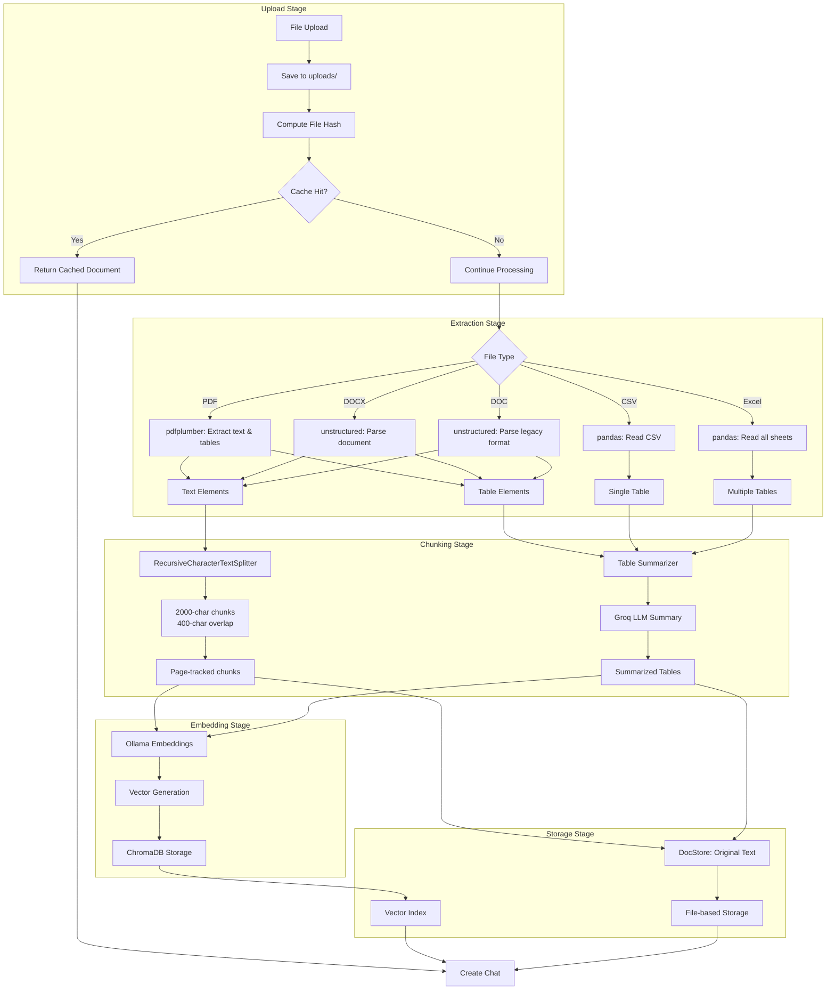
```mermaid
graph TB
    subgraph "Upload Stage"
        A[File Upload] --> B[Save to uploads/]
        B --> C[Compute File Hash]
        C --> D{Cache Hit?}
        D -->|Yes| E[Return Cached Document]
        D -->|No| F[Continue Processing]
    end
    
    subgraph "Extraction Stage"
        F --> G{File Type}
        G -->|PDF| H[pdfplumber: Extract text & tables]
        G -->|DOCX| I[unstructured: Parse document]
        G -->|DOC| J[unstructured: Parse legacy format]
        G -->|CSV| K[pandas: Read CSV]
        G -->|Excel| L[pandas: Read all sheets]
        
        H --> M[Text Elements]
        H --> N[Table Elements]
        I --> M
        I --> N
        J --> M
        J --> N
        K --> O[Single Table]
        L --> P[Multiple Tables]
    end
    
    subgraph "Chunking Stage"
        M --> Q[RecursiveCharacterTextSplitter]
        Q --> R[2000-char chunks<br/>400-char overlap]
        R --> S[Page-tracked chunks]
        
        N --> T[Table Summarizer]
        O --> T
        P --> T
        T --> U[Groq LLM Summary]
        U --> V[Summarized Tables]
    end
    
    subgraph "Embedding Stage"
        S --> W[Ollama Embeddings]
        V --> W
        W --> X[Vector Generation]
        X --> Y[ChromaDB Storage]
    end
    
    subgraph "Storage Stage"
        Y --> Z[Vector Index]
        S --> AA[DocStore: Original Text]
        V --> AA
        AA --> AB[File-based Storage]
    end
    
    E --> AC[Create Chat]
    Z --> AC
    AB --> AC
```

### Performance Optimization Flow

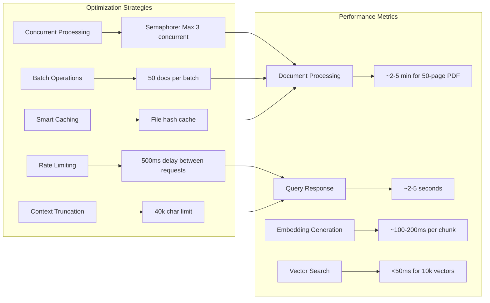
```mermaid
graph LR
    subgraph "Optimization Strategies"
        A[Concurrent Processing] --> B[Semaphore: Max 3 concurrent]
        C[Batch Operations] --> D[50 docs per batch]
        E[Rate Limiting] --> F[500ms delay between requests]
        G[Smart Caching] --> H[File hash cache]
        I[Context Truncation] --> J[40k char limit]
    end
    
    subgraph "Performance Metrics"
        K[Document Processing] --> L[~2-5 min for 50-page PDF]
        M[Query Response] --> N[~2-5 seconds]
        O[Embedding Generation] --> P[~100-200ms per chunk]
        Q[Vector Search] --> R[<50ms for 10k vectors]
    end
    
    B --> K
    D --> K
    F --> M
    H --> K
    J --> M
```

### Deployment Architecture

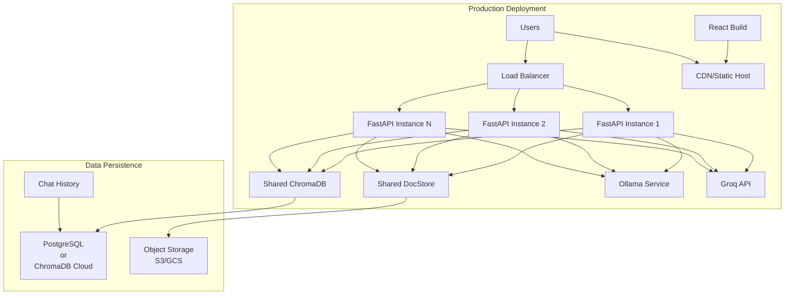
```mermaid
graph TB
    subgraph "Production Deployment"
        A[Load Balancer] --> B[FastAPI Instance 1]
        A --> C[FastAPI Instance 2]
        A --> D[FastAPI Instance N]
        
        B --> E[Shared ChromaDB]
        C --> E
        D --> E
        
        B --> F[Shared DocStore]
        C --> F
        D --> F
        
        B --> G[Ollama Service]
        C --> G
        D --> G
        
        B --> H[Groq API]
        C --> H
        D --> H
        
        I[React Build] --> J[CDN/Static Host]
        K[Users] --> A
        K --> J
    end
    
    subgraph "Data Persistence"
        E --> L[PostgreSQL<br/>or<br/>ChromaDB Cloud]
        F --> M[Object Storage<br/>S3/GCS]
        N[Chat History] --> L
    end
```

### Multi-Vector Retrieval

| Element Type | Processing | Storage | Retrieval |
|--------------|------------|---------|-----------|
| **Text Chunks** | Split into 2000-char chunks with 400-char overlap | Embedded and stored in ChromaDB | Retrieved by semantic similarity |
| **Tables** | Summarized with Groq LLM, original stored | Summary embedded, original in docstore | Retrieved via summary similarity |
| **Metadata** | Page numbers, chunk indices | Stored with each chunk | Used for citations |

### Rate Limiting & Retry Strategy

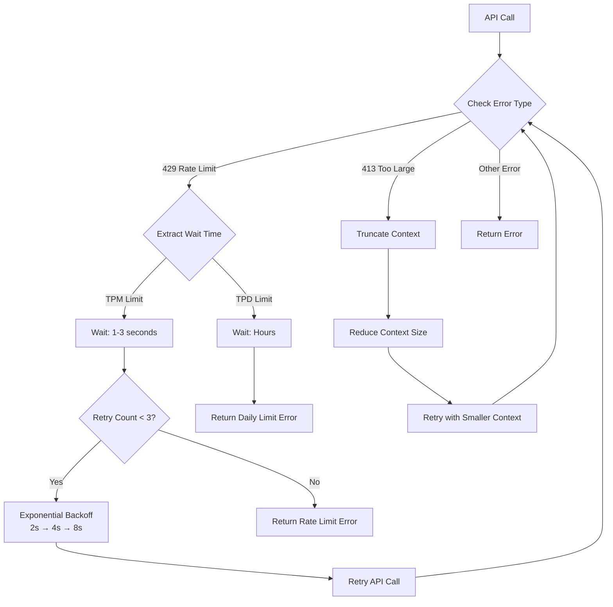
```mermaid
graph TD
    A[API Call] --> B{Check Error Type}
    B -->|429 Rate Limit| C{Extract Wait Time}
    B -->|413 Too Large| D[Truncate Context]
    B -->|Other Error| E[Return Error]
    
    C -->|TPM Limit| F[Wait: 1-3 seconds]
    C -->|TPD Limit| G[Wait: Hours]
    
    F --> H{Retry Count < 3?}
    G --> I[Return Daily Limit Error]
    
    H -->|Yes| J[Exponential Backoff<br/>2s → 4s → 8s]
    H -->|No| K[Return Rate Limit Error]
    
    J --> L[Retry API Call]
    L --> B
    
    D --> M[Reduce Context Size]
    M --> N[Retry with Smaller Context]
    N --> B
```

### Frontend Document Viewer Flow

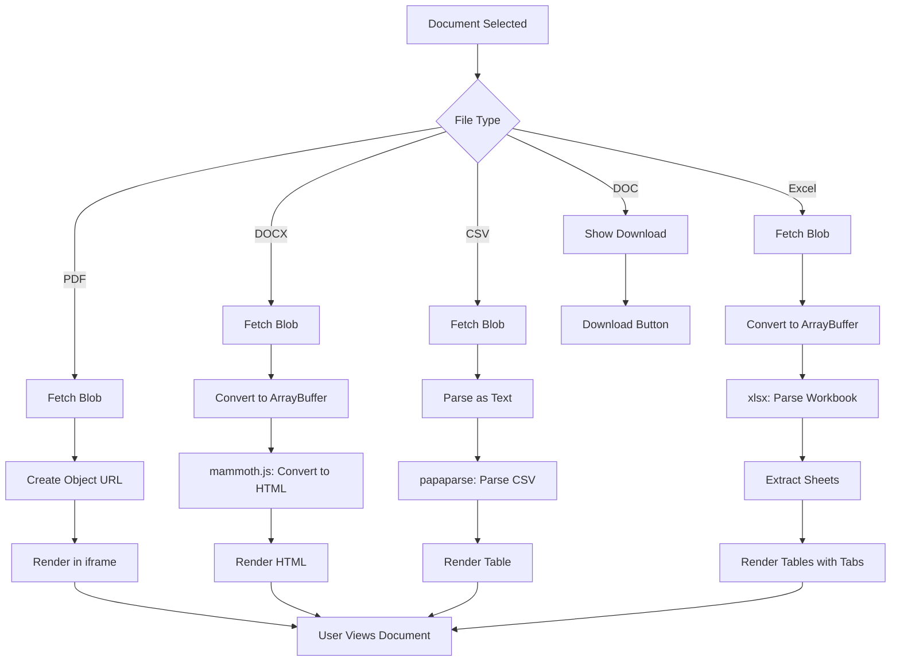
```mermaid
graph TD
    A[Document Selected] --> B{File Type}
    B -->|PDF| C[Fetch Blob]
    B -->|DOCX| D[Fetch Blob]
    B -->|CSV| E[Fetch Blob]
    B -->|Excel| F[Fetch Blob]
    B -->|DOC| G[Show Download]
    
    C --> H[Create Object URL]
    H --> I[Render in iframe]
    
    D --> J[Convert to ArrayBuffer]
    J --> K[mammoth.js: Convert to HTML]
    K --> L[Render HTML]
    
    E --> M[Parse as Text]
    M --> N[papaparse: Parse CSV]
    N --> O[Render Table]
    
    F --> P[Convert to ArrayBuffer]
    P --> Q[xlsx: Parse Workbook]
    Q --> R[Extract Sheets]
    R --> S[Render Tables with Tabs]
    
    I --> T[User Views Document]
    L --> T
    O --> T
    S --> T
    G --> U[Download Button]
```

### Caching Strategy

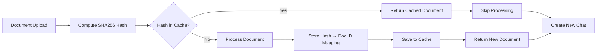
```mermaid
graph LR
    A[Document Upload] --> B[Compute SHA256 Hash]
    B --> C{Hash in Cache?}
    C -->|Yes| D[Return Cached Document]
    C -->|No| E[Process Document]
    E --> F[Store Hash → Doc ID Mapping]
    F --> G[Save to Cache]
    G --> H[Return New Document]
    
    D --> I[Skip Processing]
    I --> J[Create New Chat]
    H --> J
```

### Token Budget Management

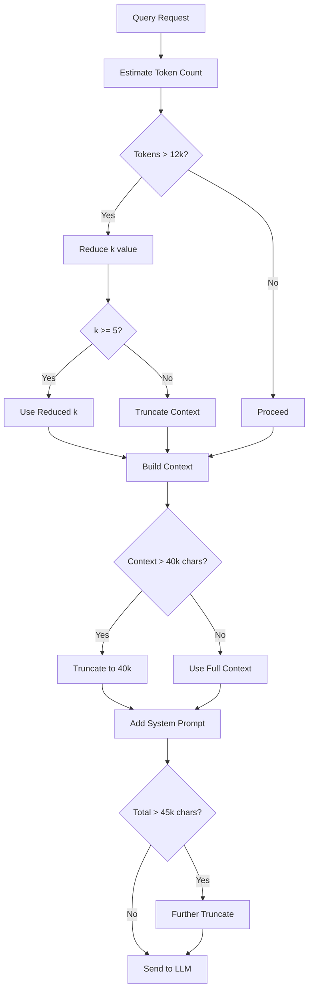
```mermaid
graph TD
    A[Query Request] --> B[Estimate Token Count]
    B --> C{Tokens > 12k?}
    C -->|Yes| D[Reduce k value]
    C -->|No| E[Proceed]
    
    D --> F{k >= 5?}
    F -->|Yes| G[Use Reduced k]
    F -->|No| H[Truncate Context]
    
    G --> I[Build Context]
    H --> I
    E --> I
    
    I --> J{Context > 40k chars?}
    J -->|Yes| K[Truncate to 40k]
    J -->|No| L[Use Full Context]
    
    K --> M[Add System Prompt]
    L --> M
    
    M --> N{Total > 45k chars?}
    N -->|Yes| O[Further Truncate]
    N -->|No| P[Send to LLM]
    O --> P
```

---

## 🔬 Technical Deep Dive

### Embedding Generation Process

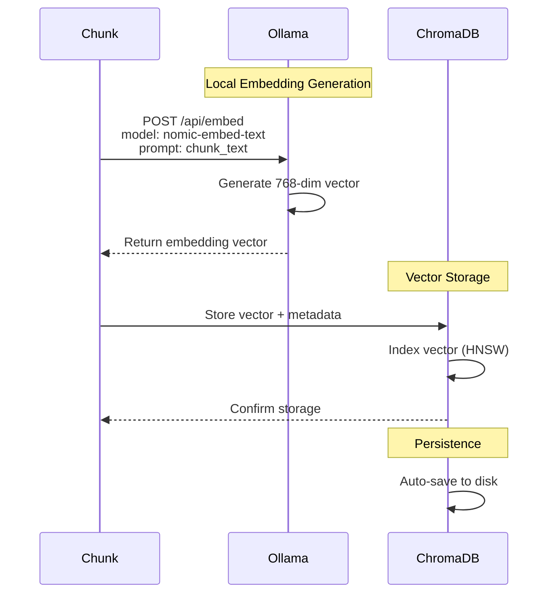
```mermaid
sequenceDiagram
    participant Chunk
    participant Ollama
    participant ChromaDB
    
    Note over Ollama: Local Embedding Generation
    Chunk->>Ollama: POST /api/embed<br/>model: nomic-embed-text<br/>prompt: chunk_text
    Ollama->>Ollama: Generate 768-dim vector
    Ollama-->>Chunk: Return embedding vector
    
    Note over ChromaDB: Vector Storage
    Chunk->>ChromaDB: Store vector + metadata
    ChromaDB->>ChromaDB: Index vector (HNSW)
    ChromaDB-->>Chunk: Confirm storage
    
    Note over ChromaDB: Persistence
    ChromaDB->>ChromaDB: Auto-save to disk
```

### Table Summarization Process

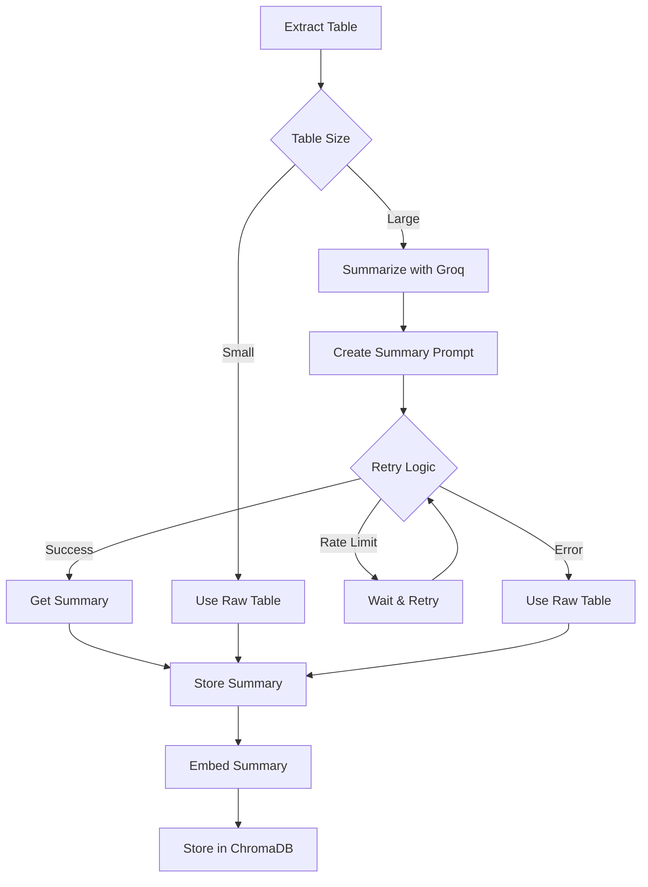
```mermaid
graph TD
    A[Extract Table] --> B{Table Size}
    B -->|Small| C[Use Raw Table]
    B -->|Large| D[Summarize with Groq]
    
    D --> E[Create Summary Prompt]
    E --> F{Retry Logic}
    F -->|Success| G[Get Summary]
    F -->|Rate Limit| H[Wait & Retry]
    F -->|Error| I[Use Raw Table]
    
    H --> F
    G --> J[Store Summary]
    C --> J
    I --> J
    
    J --> K[Embed Summary]
    K --> L[Store in ChromaDB]
```

### Streaming Response Architecture

```mermaid
sequenceDiagram
    participant Frontend
    participant FastAPI
    participant Groq
    
    Frontend->>FastAPI: POST /chats/{id}/query
    FastAPI->>FastAPI: Build context
    FastAPI->>Groq: Send query + context
    
    Note over FastAPI,Groq: Streaming Response
    Groq-->>FastAPI: Token 1
    FastAPI-->>Frontend: SSE: {"type":"chunk","content":"..."}
    Frontend->>Frontend: Append to UI
    
    Groq-->>FastAPI: Token 2
    FastAPI-->>Frontend: SSE: {"type":"chunk","content":"..."}
    Frontend->>Frontend: Append to UI
    
    Groq-->>FastAPI: Token N (complete)
    FastAPI-->>Frontend: SSE: {"type":"complete"}
    FastAPI->>FastAPI: Save to chat_history.json
    Frontend->>Frontend: Mark as complete
```

### Memory & Storage Architecture

```mermaid
graph TB
    subgraph "In-Memory (Runtime)"
        A[FastAPI App State]
        B[Active Connections]
        C[Streaming Buffers]
    end
    
    subgraph "Persistent Storage"
        D[ChromaDB<br/>chroma_data/] --> E[Vector Embeddings]
        D --> F[Collection Metadata]
        
        G[DocStore<br/>docstore/] --> H[Original Text Chunks]
        G --> I[Original Tables]
        
        J[JSON Files] --> K[chat_history.json]
        J --> L[documents.json]
        J --> M[document_cache.json]
        
        N[File Storage<br/>uploads/] --> O[Original Documents]
    end
    
    A --> D
    A --> G
    A --> J
    A --> N
    
    B --> C
    C --> A
```

### Error Recovery Mechanisms

| Error Type | Detection | Recovery Strategy | User Impact |
|------------|-----------|-------------------|-------------|
| **Rate Limit (429)** | API response code | Exponential backoff (2s, 4s, 8s), max 3 retries | Automatic retry, user sees delay |
| **Request Too Large (413)** | API response code | Truncate context further, reduce k | Automatic handling, may lose context |
| **Context Length (400)** | API response code | Truncate context, return error message | User-friendly error, suggests specific query |
| **Ollama Connection** | Connection refused | Return error, suggest checking Ollama | Clear error message with solution |
| **Embedding Error** | Exception caught | Skip chunk, continue processing | Partial indexing, warning logged |
| **File Processing Error** | Exception caught | Return error in SSE stream | User sees error, can retry upload |

---

## ⚙️ Advanced Configuration

### Chunking Strategy

Adjust for different document types:

```python
# For technical papers (more context needed)
chunk_size = 2500
chunk_overlap = 500

# For shorter documents (faster processing)
chunk_size = 1500
chunk_overlap = 300

# Current setting (balanced)
chunk_size = 2000
chunk_overlap = 400
```

### Retrieval Tuning

Balance between context and token limits:

```python
# More context (may exceed token limits)
k = 15  # Not recommended - may hit TPM limits

# Balanced (recommended)
k = 10  # Current setting

# Less context (faster, stays well within limits)
k = 5
```

### LLM Temperature

Control response creativity:

```python
# More deterministic (factual documents)
temperature = 0.1

# Balanced (current)
temperature = 0.3

# More creative (brainstorming)
temperature = 0.7
```

### Context Length Limits

| Limit | Value | Purpose |
|-------|-------|---------|
| Max Context Length | 40,000 chars | Prevents token overflow (TPM: 12k tokens) |
| Max Chunk Length | 20,000 chars | Limits individual table/text chunks |
| Max Total Message | 45,000 chars | Includes system prompt and query |

---

## 🐛 Troubleshooting

### Troubleshooting Decision Tree

```mermaid
graph TD
    A[Error Occurred] --> B{Error Type}
    
    B -->|Connection Error| C{Ollama Running?}
    C -->|No| D[Start Ollama Service]
    C -->|Yes| E[Check Port 11434]
    
    B -->|API Error| F{Error Code}
    F -->|429| G{Rate Limit Type}
    G -->|TPM| H[Wait 1 minute]
    G -->|TPD| I[Wait until reset]
    
    F -->|413| J[Context Too Large]
    J --> K[Ask More Specific Question]
    
    F -->|401| L[Check API Key]
    L --> M[Verify .env file]
    
    B -->|Processing Error| N{File Type}
    N -->|PDF| O[Check pdfplumber]
    N -->|DOCX| P[Check unstructured]
    N -->|CSV/Excel| Q[Check pandas]
    
    B -->|Viewer Error| R{File Format}
    R -->|PDF| S[Check Browser Support]
    R -->|DOCX| T[Check mammoth.js]
    R -->|CSV/Excel| U[Check xlsx/papaparse]
    
    D --> V[Retry Operation]
    E --> V
    H --> V
    I --> V
    K --> V
    M --> V
    O --> V
    P --> V
    Q --> V
    S --> V
    T --> V
    U --> V
```

### Common Issues

#### 1. "Failed to fetch" error
**Solution**: Ensure backend is running on port 8000
```bash
cd backend
uvicorn main:app --reload
```

#### 2. Ollama connection error
**Solution**: Ensure Ollama is running
```bash
# Check if Ollama is running
curl http://127.0.0.1:11434/api/tags

# Start Ollama if not running
ollama serve

# Pull the embedding model
ollama pull nomic-embed-text
```

#### 3. Groq API errors
**Solution**: Check your API key and quotas
- Verify `GROQ_API_KEY` in `backend/.env` file
- Check [Groq Console](https://console.groq.com) for usage limits
- Free tier: 12,000 tokens/minute, 100,000 tokens/day
- Upgrade to Dev Tier for higher limits

#### 4. "Request too large" (413) error
**Solution**: Document context exceeds token limits
- The system automatically truncates, but very large documents may still fail
- Try asking more specific questions
- Consider splitting large documents

#### 5. Rate limit errors (429)
**Solution**: API rate limits exceeded
- **TPM (Tokens Per Minute)**: Wait a minute and retry
- **TPD (Tokens Per Day)**: Wait until reset or upgrade plan
- The system includes automatic retry logic with exponential backoff

#### 6. Empty ChromaDB index
**Solution**: Delete existing index and re-upload documents
```bash
rm -rf backend/chroma_data/
rm -rf backend/docstore/
```

#### 7. Document viewer not working
**Solution**: Check file type support
- PDF: Should work in all browsers
- DOCX: Requires mammoth.js (installed automatically)
- CSV/Excel: Requires xlsx/papaparse (installed automatically)
- DOC: No preview available, download only

### Performance Optimization Tips

```mermaid
graph LR
    A[Optimization Goals] --> B[Reduce Processing Time]
    A --> C[Lower Token Usage]
    A --> D[Improve Response Speed]
    
    B --> E[Use Document Cache]
    B --> F[Batch Embeddings]
    B --> G[Parallel Processing]
    
    C --> H[Reduce k Value]
    C --> I[Truncate Large Chunks]
    C --> J[Optimize Prompts]
    
    D --> K[Use Streaming]
    D --> L[Cache Embeddings]
    D --> M[Optimize Vector Search]
    
    E --> N[Better Performance]
    F --> N
    G --> N
    H --> N
    I --> N
    J --> N
    K --> N
    L --> N
    M --> N
```

### System Health Check

```mermaid
graph TD
    A[Health Check] --> B[Check Ollama]
    A --> C[Check ChromaDB]
    A --> D[Check Groq API]
    A --> E[Check Storage]
    
    B --> F{Ollama Responding?}
    F -->|Yes| G[✓ Healthy]
    F -->|No| H[✗ Start Ollama]
    
    C --> I{ChromaDB Accessible?}
    I -->|Yes| G
    I -->|No| J[✗ Check Permissions]
    
    D --> K{API Key Valid?}
    K -->|Yes| G
    K -->|No| L[✗ Update .env]
    
    E --> M{Disk Space > 1GB?}
    M -->|Yes| G
    M -->|No| N[✗ Free Space]
    
    G --> O[System Ready]
    H --> P[Fix Issues]
    J --> P
    L --> P
    N --> P
    P --> A
```

---

## 🔐 Security Considerations

### API Key Management
- ✅ **Backend Storage**: Groq API key stored in `.env` file (not in git)
- ✅ **No Frontend Exposure**: API keys never sent to frontend
- ✅ **Secure Transmission**: Keys used only in backend-to-API communication
- ⚠️ **Important**: Never commit `.env` file to version control

### Production Deployment Checklist
- [ ] Add authentication (JWT tokens) for multi-user support
- [ ] Implement rate limiting per user/IP
- [ ] Enable HTTPS/TLS (required for secure communication)
- [ ] Validate file uploads (size, type, content)
- [ ] Sanitize user inputs
- [ ] Enable CORS only for trusted origins
- [ ] Implement request timeouts
- [ ] Add logging and monitoring
- [ ] Set up backup for data files
- [ ] Use environment-specific `.env` files
- [ ] Secure Ollama instance (if exposed)

---

## 🤝 Contributing

Contributions are welcome! Please follow these steps:

1. Fork the repository
2. Create a feature branch (`git checkout -b feature/AmazingFeature`)
3. Commit your changes (`git commit -m 'Add AmazingFeature'`)
4. Push to the branch (`git push origin feature/AmazingFeature`)
5. Open a Pull Request

### Development Guidelines
- Follow PEP 8 for Python code
- Use ESLint for JavaScript/React
- Write descriptive commit messages
- Add tests for new features
- Update documentation

---

## 📄 License

This project is licensed under the MIT License - see the [LICENSE](LICENSE) file for details.

---

## 🙏 Acknowledgments

- **LangChain**: For the RAG framework
- **Groq**: For fast LLM inference
- **Ollama**: For local embeddings
- **ChromaDB**: For vector storage
- **Unstructured.io**: For document parsing
- **FastAPI**: For the backend framework
- **React**: For the frontend framework
- **Tailwind CSS**: For styling
- **SheetJS (xlsx)**: For Excel file handling
- **Mammoth.js**: For DOCX rendering
- **PapaParse**: For CSV parsing

---

## 📊 Performance Benchmarks

### Processing Times

| Document Type | Size | Processing Time | Breakdown |
|--------------|------|----------------|-----------|
| PDF (10 pages) | ~500 KB | ~30-60 seconds | Extraction: 5s, Chunking: 2s, Embedding: 20s, Indexing: 10s |
| PDF (50 pages) | ~2 MB | ~2-5 minutes | Extraction: 20s, Chunking: 10s, Embedding: 90s, Indexing: 40s |
| DOCX (20 pages) | ~300 KB | ~45-90 seconds | Extraction: 10s, Chunking: 5s, Embedding: 30s, Indexing: 15s |
| CSV (1000 rows) | ~500 KB | ~10-20 seconds | Parsing: 2s, Embedding: 5s, Indexing: 3s |
| Excel (5 sheets, 500 rows each) | ~1 MB | ~30-60 seconds | Parsing: 5s, Embedding: 20s, Indexing: 10s |

### Query Performance

| Query Type | Response Time | Factors |
|-----------|---------------|---------|
| Simple question (1-2 chunks) | 1-3 seconds | Embedding: 50ms, Search: 20ms, LLM: 1-2s |
| Complex question (5-10 chunks) | 2-5 seconds | Embedding: 50ms, Search: 30ms, LLM: 2-4s |
| Large context (>30k chars) | 3-7 seconds | Includes truncation overhead, LLM: 3-6s |

### Resource Usage

| Component | CPU Usage | Memory Usage | Notes |
|-----------|-----------|--------------|-------|
| FastAPI Server (idle) | <1% | ~50-100 MB | Base server overhead |
| Document Processing | 20-40% | +200-500 MB | During active processing |
| Ollama (idle) | <5% | ~500 MB | Base Ollama service |
| Ollama (embedding) | 30-60% | +100-200 MB | During embedding generation |
| ChromaDB | <10% | ~100-300 MB | Scales with document count |

---

## 🚀 Deployment Guide

### Development Setup

```mermaid
graph LR
    A[Developer Machine] --> B[Ollama Local<br/>127.0.0.1:11434]
    A --> C[FastAPI Backend<br/>localhost:8000]
    A --> D[React Frontend<br/>localhost:5173]
    C --> B
    C --> E[Groq API<br/>Cloud]
    D --> C
```

### Production Deployment Options

#### Option 1: Single Server Deployment

```mermaid
graph TB
    A[Domain Name] --> B[Nginx Reverse Proxy]
    B --> C[FastAPI Backend<br/>Gunicorn/Uvicorn]
    B --> D[React Build<br/>Static Files]
    
    C --> E[Ollama Service<br/>Same Server]
    C --> F[ChromaDB<br/>Local Storage]
    C --> G[Groq API<br/>Cloud]
    
    F --> H[Backup Script<br/>Daily]
```

#### Option 2: Containerized Deployment

```mermaid
graph TB
    A[Docker Compose] --> B[Backend Container]
    A --> C[Frontend Container]
    A --> D[Ollama Container]
    
    B --> E[ChromaDB Volume]
    B --> F[Uploads Volume]
    B --> G[Groq API<br/>Cloud]
    
    D --> B
    C --> B
```

### Environment Variables

| Variable | Development | Production | Description |
|----------|------------|------------|-------------|
| `GROQ_API_KEY` | Required | Required | Groq API key for LLM |
| `OLLAMA_BASE_URL` | `http://127.0.0.1:11434` | `http://ollama:11434` | Ollama service URL |
| `CORS_ORIGINS` | `["*"]` | `["https://yourdomain.com"]` | Allowed CORS origins |
| `LOG_LEVEL` | `DEBUG` | `INFO` | Logging level |
| `MAX_UPLOAD_SIZE` | `50MB` | `100MB` | Maximum file upload size |

---

## 📈 Scalability Considerations

### Horizontal Scaling

```mermaid
graph TB
    A[Load Balancer] --> B[Backend Instance 1]
    A --> C[Backend Instance 2]
    A --> D[Backend Instance N]
    
    B --> E[Shared ChromaDB<br/>PostgreSQL/Cloud]
    C --> E
    D --> E
    
    B --> F[Shared DocStore<br/>S3/Object Storage]
    C --> F
    D --> F
    
    B --> G[Ollama Cluster]
    C --> G
    D --> G
```

### Scaling Limits

| Component | Current Limit | Scaling Strategy |
|-----------|---------------|------------------|
| **ChromaDB** | ~100k vectors per collection | Use multiple collections or PostgreSQL |
| **Ollama** | Single instance | Deploy Ollama cluster with load balancer |
| **Groq API** | 12k TPM (free tier) | Upgrade to Dev Tier or use multiple API keys |
| **File Storage** | Local disk | Migrate to S3/GCS for cloud storage |
| **Concurrent Users** | Limited by server resources | Add more backend instances |

---

## 🔍 Monitoring & Logging

### Key Metrics to Monitor

| Metric | Type | Threshold | Action |
|--------|------|-----------|--------|
| **API Response Time** | Performance | >5s | Check Ollama/Groq latency |
| **Error Rate** | Reliability | >5% | Review error logs |
| **Rate Limit Hits** | Usage | Frequent | Upgrade API tier or optimize |
| **ChromaDB Size** | Storage | >10GB | Archive old documents |
| **Memory Usage** | Resource | >80% | Scale up or optimize |
| **Ollama CPU** | Resource | >80% | Add more Ollama instances |

### Logging Strategy

```mermaid
graph LR
    A[Application Logs] --> B{Log Level}
    B -->|DEBUG| C[Development]
    B -->|INFO| D[Production]
    B -->|ERROR| E[Alerting]
    
    C --> F[Console Output]
    D --> G[File Logs]
    E --> H[Error Tracking<br/>Sentry/Similar]
    
    G --> I[Log Rotation]
    H --> J[Notifications]
```

---

## 📚 Additional Resources

### Learning Resources

| Topic | Resource | Description |
|-------|----------|-------------|
| **RAG Concepts** | [LangChain RAG Tutorial](https://python.langchain.com/docs/use_cases/question_answering/) | Learn about RAG architecture |
| **Ollama** | [Ollama Documentation](https://ollama.ai/docs) | Local LLM and embedding models |
| **Groq API** | [Groq Documentation](https://console.groq.com/docs) | Fast LLM inference API |
| **ChromaDB** | [ChromaDB Docs](https://docs.trychroma.com/) | Vector database documentation |
| **FastAPI** | [FastAPI Docs](https://fastapi.tiangolo.com/) | Modern Python web framework |

### Key Concepts Explained

#### What is RAG?
**Retrieval-Augmented Generation (RAG)** combines information retrieval with language generation:
1. **Retrieval**: Find relevant document chunks using semantic search
2. **Augmentation**: Add retrieved context to the user's query
3. **Generation**: Use LLM to generate answer based on context

#### Why Multi-Vector Retrieval?
- **Text chunks**: Preserve full context for detailed questions
- **Table summaries**: Enable quick table lookup without processing entire tables
- **Metadata**: Track page numbers for accurate citations

#### Token Limits Explained
- **TPM (Tokens Per Minute)**: Groq free tier allows 12,000 tokens/minute
- **TPD (Tokens Per Day)**: Groq free tier allows 100,000 tokens/day
- **Context Window**: LLM can process ~32k-128k tokens, but we limit to 12k for rate limits
- **Character to Token**: Roughly 4 characters = 1 token

### Component Interaction Matrix

| Component | Interacts With | Protocol | Purpose |
|-----------|---------------|----------|---------|
| **Frontend** | Backend API | HTTP/SSE | Send requests, receive streams |
| **Backend** | Ollama | HTTP | Generate embeddings |
| **Backend** | ChromaDB | Python API | Store/query vectors |
| **Backend** | Groq API | HTTPS | Generate LLM responses |
| **Backend** | DocStore | File System | Store original content |
| **Frontend** | Document Files | HTTP | Fetch files for viewing |

---

## 📞 Support

- **Issues**: [GitHub Issues](https://github.com/Aafimalek/advanced_rag/issues)
- **Documentation**: See this README and inline code comments
- **Community**: Join discussions in GitHub Discussions

### Getting Help

| Issue Type | Where to Ask | Response Time |
|------------|--------------|---------------|
| **Bug Report** | GitHub Issues | Within 48 hours |
| **Feature Request** | GitHub Discussions | Community discussion |
| **Usage Question** | GitHub Discussions | Community help |
| **Security Issue** | Private email | Immediate attention |

---

<div align="center">

**Built with ❤️ using React, FastAPI, Ollama, and Groq**

⭐ Star this repo if you find it helpful!

</div>
